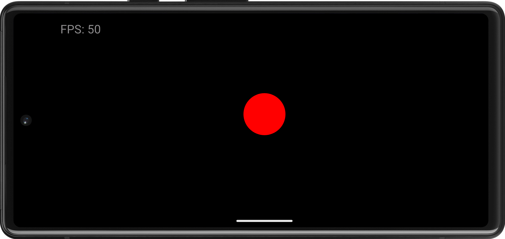

# Android Game Base

This is a minimal Android game with a game loop and state. It does its rendering on a
`SurfaceView` and doesn't require any third party libraries like libgdx.

## Build app bundle

Make sure to run Gradle with at least Java 11.

    ./gradlew :app:bundleRelease